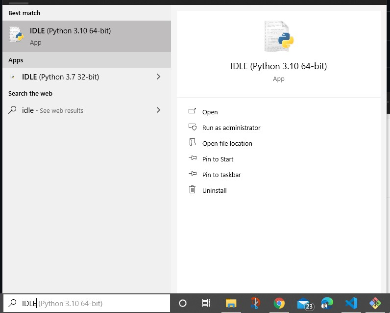
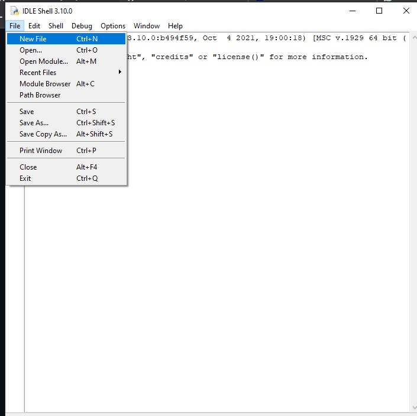
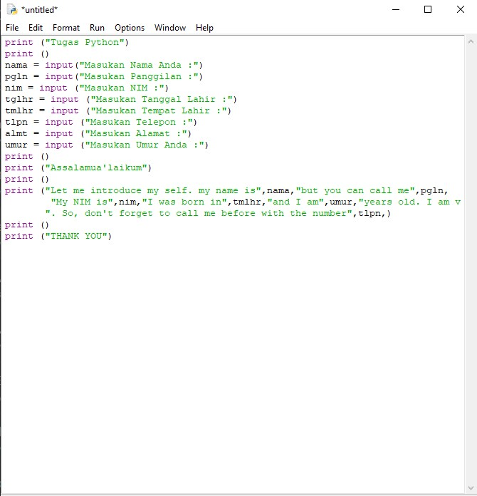
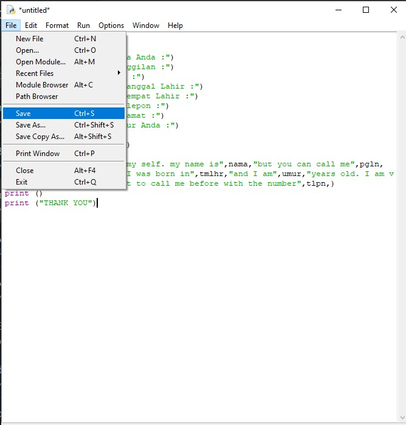
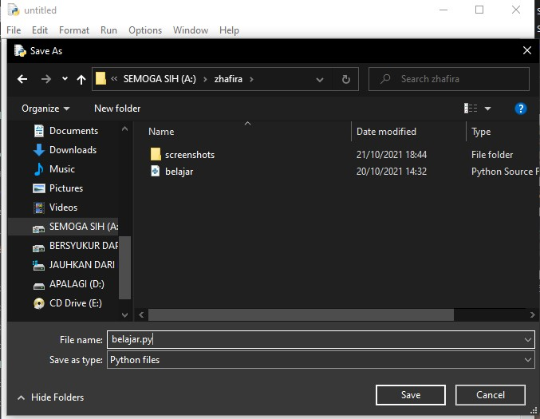
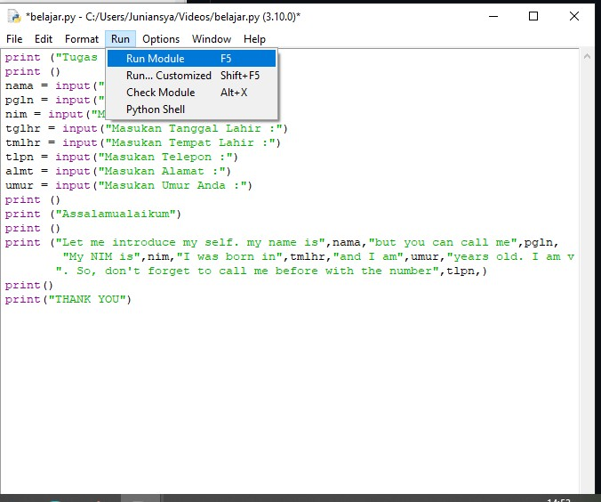
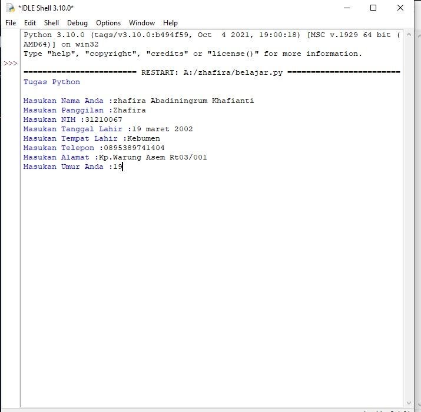
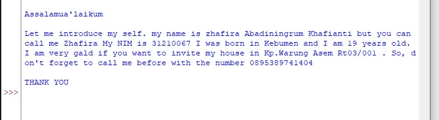

# latihan_python

## Instalasi Python
Download Python terlebih dahulu, di website resmi [Python](https://www.python.org/)

# Cara Input Menggunakan Python

- Buka IDLE Python di pencarian


<p align="center">
 
</p>
- Kemudian klik 
```bash
> File
> New File
```

<p align="center">
 
</p>

- Masukan koding yang kalian ingin gunakan


<p align="center">
 
</p>

- Setelah itu klik
```bash
> File
> Save
```
<p align="center">
 
</p>

- Untuk menyimpan file Python
```bash
> "JANGAN LUPA MENGGUNAKAN .py"
```

<p align="center">
 
</p>
- Kemudian klik Run untuk menjalankan program
```bash
> Run
> Run Module
```

<p align="center">
 
</p>

 # Input
- input data kalian

<p align="center">
 
</p>
# Output
- hasil

<p align="center">
 
</p>
- Selesai

## Terima Kasih